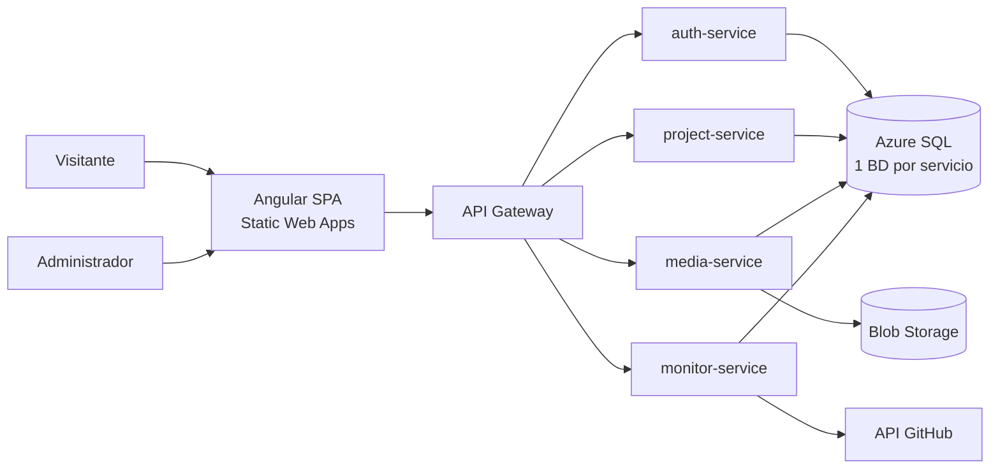
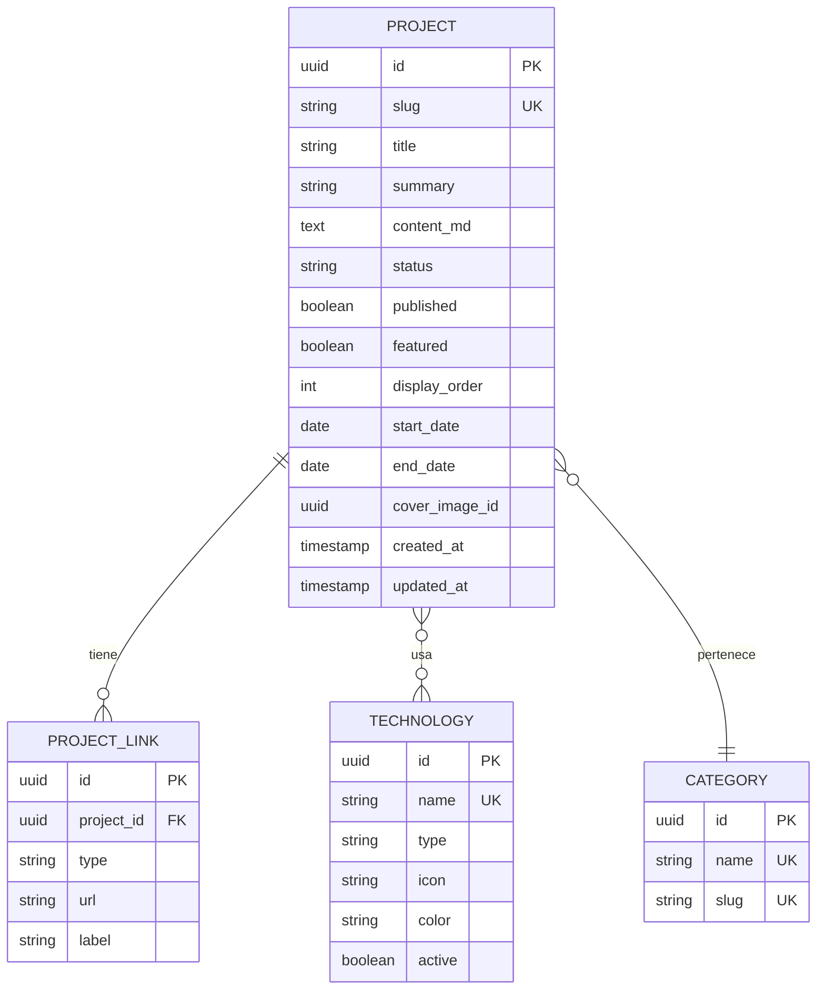

# Portafolio de Proyectos — Especificación de Requerimientos de Software (SRS)

Versión 1.2 · 28 de septiembre de 2026 · Juan Fernando Velandia

## 1. Control del documento

Este documento es la línea base de requerimientos (v1.2) del producto **DevFolio**, el portafolio de proyectos. Integra en un solo documento la especificación general y los requisitos de seguridad (RNF-SEG). Vive en el repositorio (/docs/srs.md), que es la única fuente de verdad; la Wiki de Azure DevOps solo contiene un índice con enlaces (ADR-0003). Todo cambio posterior se registra en el historial y se aprueba mediante Pull Request.

| Campo | Valor |
| --- | --- |
| Producto | DevFolio — Portafolio de proyectos (nombre provisional) |
| Código del proyecto | DVF |
| Versión del documento | 1.2 |
| Estado | Línea base vigente; fase F0 en curso (Sprint 0 iniciado el 2026-09-21) |
| Estándar de referencia | ISO/IEC/IEEE 29148:2018 (requerimientos); ISO/IEC 25010:2023 (calidad); OWASP ASVS 5.0.0 (seguridad) |
| Propietario del producto | Autor del portafolio |
| Rol de desarrollo | Autor del portafolio (desarrollador full stack) |
| Herramienta de gestión | Azure DevOps (Boards + Wiki), proyecto privado con el proceso heredado DevFolio Agile, integrado con GitHub |

### Historial de cambios

| Versión | Fecha | Autor | Descripción |
| --- | --- | --- | --- |
| 1.2 | 2026-09-28 | Juan Fernando Velandia | Decisiones de F0: ADR-0002 a ADR-0007, GitHub como fuente de verdad de la documentación, proyecto privado en Azure DevOps, suscripción de Azure creada en F0, autopausa de 15 minutos, sondas sin acceso a la base, historias HU-09 a HU-13, riesgos como Issues, F0 extendida a dos sprints; HU-04 a HU-08 con requerimiento principal y regla de división; estado del documento, stack (9.3) y Definition of Done alineados con ADR-0003 |
| 1.1 | 2026-09-28 | Juan Fernando Velandia | Unificación con "Requisitos de seguridad (RNF-SEG)": la sección 5.2 pasa de 9 a 46 requisitos trazados a OWASP ASVS 5.0; se renumeran los RNF-SEG (Anexo A); se alinean RF-AUT, RF-CON, RF-MED, RN-11, RN-12, HU-04, entornos (staging), DoD, matriz, riesgos y glosario (Anexo B); nuevo objetivo OBJ-5 |
| 1.0 | 2026-09-22 | Autor | Base de datos cambia a Azure SQL Database (oferta gratuita permanente, una BD por servicio); gestión en Azure DevOps; imágenes nativas GraalVM; nuevo RF de perfil; riesgos y glosario |
| 0.1 | 2026-09-22 | Autor | Versión inicial: requerimientos funcionales, no funcionales, arquitectura y plan de entregas |

### Convenciones de identificación

- **RF-XXX-NN**: requerimiento funcional (XXX = módulo).
- **RNF-XXX-NN**: requerimiento no funcional (XXX = categoría).
- **RN-NN**: regla de negocio.
- **HU-NN**: historia de usuario.
- **RSK-NN**: riesgo.
- **Prioridad (MoSCoW)**: Must = obligatorio; en seguridad, bloquea la release de su fase. Should = importante; en seguridad, entra en la fase salvo impedimento justificado en un ADR. Could = deseable. Won't = fuera de alcance por ahora.
- **Fase**: release en la que se implementa (ver sección 10). A partir de esa fase, el requerimiento aplica a todo el código nuevo.
- **Verificación** (requisitos de seguridad): T = test automatizado, S = análisis estático o de dependencias, D = escaneo dinámico (DAST), R = revisión manual o pentest, C = revisión de configuración.

## 2. Introducción

### 2.1 Propósito

DevFolio es una aplicación web para publicar y administrar los proyectos del autor: URLs, imágenes, descripciones y tecnologías. El sistema es a la vez vitrina y proyecto de aprendizaje: demuestra una arquitectura de microservicios (Angular + Spring Boot + Azure SQL Database) desplegada en Azure con costo cercano a cero.

### 2.2 Audiencia del documento

- **Autor (Product Owner y desarrollador)**: guía de implementación y priorización.
- **Reclutadores y líderes técnicos**: evidencia de un proceso de ingeniería profesional; el documento se publicará como parte del portafolio.

### 2.3 Alcance

**Dentro del alcance**

- Sitio público con listado, filtros y detalle de proyectos.
- Panel de administración privado para gestionar proyectos, tecnologías, categorías e imágenes.
- Autenticación de un único administrador con segundo factor.
- Gestión de imágenes en almacenamiento de objetos.
- Monitoreo del estado en línea de los proyectos publicados.
- Formulario de contacto y métricas básicas de visitas.
- Pipeline CI/CD y despliegue en Azure (niveles gratuitos).
- Seguridad del repositorio público, del pipeline y de la cadena de suministro.

**Fuera del alcance (v1)**

- Registro de usuarios públicos, comentarios o reacciones.
- Múltiples administradores o multitenencia (un portafolio por usuario).
- Blog completo con editor enriquecido.
- Aplicación móvil nativa.
- Pagos o funcionalidades comerciales.
- Seguridad física, seguridad interna de los servicios gestionados de Azure y GitHub (modelo de responsabilidad compartida) y protección DDoS volumétrica, tratada como riesgo aceptado (sección 12.2).

### 2.4 Objetivos del producto

| ID | Objetivo | Indicador de éxito |
| --- | --- | --- |
| OBJ-1 | Mostrar los proyectos de forma profesional | Un visitante encuentra un proyecto por tecnología en menos de 3 clics |
| OBJ-2 | Publicar un proyecto nuevo sin tocar código | Alta completa desde el panel en menos de 5 minutos |
| OBJ-3 | Aprender y demostrar microservicios en la nube | 4+ servicios desplegados con CI/CD automatizado |
| OBJ-4 | Operar con costo cercano a cero | Gasto mensual en Azure menor a 1 USD |
| OBJ-5 | Demostrar seguridad verificable | El pentest previo a v1.0.0 no deja hallazgos críticos ni altos, y los riesgos residuales están documentados y aceptados |

### 2.5 Referencias

- ISO/IEC/IEEE 29148:2018 — Requerimientos de sistemas y software.
- ISO/IEC 25010:2023 — Modelo de calidad de producto (base de la sección 5).
- [OWASP ASVS 5.0.0](https://owasp.org/www-project-application-security-verification-standard/) (mayo de 2025), niveles L1 y L2 — requisitos de seguridad (sección 5.2).
- [OWASP Top 10](https://owasp.org/www-project-top-ten/) y [OWASP API Security Top 10 (2023)](https://owasp.org/API-Security/) — comprobación de cobertura de riesgos.
- [OWASP Web Security Testing Guide](https://owasp.org/www-project-web-security-testing-guide/) — metodología del pentest.
- [Microsoft Security Testing Rules of Engagement](https://www.microsoft.com/en-us/msrc/pentest-rules-of-engagement) — límites de las pruebas en Azure.
- RFC 9457 (Problem Details) y RFC 9116 (security.txt).
- WCAG 2.2 nivel AA — accesibilidad.
- Ley 1581 de 2012 (Colombia) — protección de datos personales.
- Documentación oficial de Azure Free Account (verificar límites vigentes antes de cada release).

## 3. Descripción general

### 3.1 Perspectiva del producto

DevFolio es un sistema nuevo e independiente. Se compone de un frontend Angular (sitio público + panel admin), un API Gateway y microservicios Spring Boot, cada uno dueño de sus datos. Se integra con servicios externos: Azure Blob Storage, API de GitHub, un proveedor de correo, Cloudflare Turnstile y Application Insights.



El diagrama muestra el contexto: dos actores humanos entran por la SPA y todo el tráfico de API pasa por el gateway. Solo la SPA y el gateway son accesibles desde internet (RNF-SEG-02).

### 3.2 Actores

| Actor | Descripción | Acceso |
| --- | --- | --- |
| Visitante | Reclutador, colega o cualquier persona que navega el portafolio | Sitio público, sin autenticación |
| Administrador | Autor del portafolio; único usuario con credenciales | Panel admin; requiere contraseña, segundo factor TOTP y JWT válido con rol ADMIN |
| Sistema de monitoreo | Proceso programado que verifica URLs y sincroniza GitHub | Interno, sin interfaz |
| Servicios externos | GitHub API, Azure Blob Storage, proveedor de correo, Cloudflare Turnstile | Integración por API |

### 3.3 Restricciones

- **RES-01**: Frontend en Angular (versión LTS vigente) con TypeScript estricto.
- **RES-02**: Backend en Spring Boot 3.x con Java 21 (LTS); en producción, imágenes nativas GraalVM.
- **RES-03**: Base de datos relacional Azure SQL Database con la oferta gratuita permanente (hasta 10 bases serverless por suscripción), una por microservicio y entorno; acceso con Spring Data JPA y Flyway, sin SQL específico del motor.
- **RES-04**: Arquitectura de microservicios con un API Gateway como único punto de entrada.
- **RES-05**: Despliegue en servicios gratuitos de Azure; presupuesto objetivo menor a 1 USD/mes.
- **RES-06**: Código fuente y documentación en un repositorio público de GitHub (fuente de verdad) y CI/CD con GitHub Actions; gestión del trabajo en Azure DevOps Boards, con un índice de la documentación en su Wiki (ADR-0003).
- **RES-07**: Un solo desarrollador; el alcance de cada fase debe caber en 2–4 semanas de trabajo parcial.
- **RES-08**: Las pruebas de seguridad sobre Azure respetan las Rules of Engagement de Microsoft: solo recursos propios, sin denegación de servicio, sin fuzzing de tráfico excesivo y sin post-explotación.

### 3.4 Supuestos y dependencias

- **SUP-01**: El tráfico esperado es bajo (menos de 1.000 visitas/mes), lo que permite escalar a cero.
- **SUP-02**: Se acepta un arranque en frío de hasta 30 s en la primera petición tras inactividad (mitigable con imágenes nativas GraalVM).
- **SUP-03**: Los límites de la capa gratuita de Azure se mantienen similares durante el desarrollo; se revisan antes de cada release.
- **SUP-04**: Los proyectos del portafolio tienen repositorio público en GitHub (opcional por proyecto).
- **SUP-05**: Como el repositorio es público, se asume que un atacante conoce el código, la arquitectura y el pipeline; la seguridad no depende de ocultar nada.
- **DEP-01**: Disponibilidad de la API pública de GitHub (límite de 60 peticiones/hora sin token; 5.000 con token).
- **DEP-02**: GitHub ofrece gratis a repositorios públicos CodeQL, secret scanning con push protection y Dependabot.

## 4. Requerimientos funcionales

El sistema define 56 requerimientos funcionales en 8 módulos; 26 son Must y forman el producto mínimo de las fases 1–3. Cada requerimiento se registra en Azure DevOps Boards como Feature con su ID en el título, y se descompone en historias de usuario hijas (ver sección 10.4).

### 4.1 Módulo PUB — Sitio público

| ID | Requerimiento | Prioridad | Fase |
| --- | --- | --- | --- |
| RF-PUB-01 | El sistema debe mostrar una página de inicio con presentación del autor (nombre, rol, resumen, foto, enlaces a GitHub/LinkedIn/CV). | Must | F1 |
| RF-PUB-02 | El sistema debe mostrar los proyectos destacados en la página de inicio, en el orden definido por el administrador. | Must | F1 |
| RF-PUB-03 | El sistema debe listar todos los proyectos publicados en tarjetas con imagen de portada, título, resumen y chips de tecnologías. | Must | F1 |
| RF-PUB-04 | El visitante debe poder filtrar proyectos por una o varias tecnologías. | Must | F1 |
| RF-PUB-05 | El visitante debe poder filtrar por categoría (web, backend, móvil, data…) y por estado (en desarrollo, en producción, archivado). | Should | F1 |
| RF-PUB-06 | El visitante debe poder buscar proyectos por texto en título y resumen. | Should | F2 |
| RF-PUB-07 | El listado debe paginarse o cargarse de forma incremental a partir de 12 proyectos (máximo 50 por página, RNF-SEG-27). | Should | F2 |
| RF-PUB-08 | El sistema debe mostrar una página de detalle por proyecto, accesible por URL amigable (/proyectos/{slug}). | Must | F1 |
| RF-PUB-09 | La página de detalle debe mostrar: descripción larga en Markdown renderizado (sanitizado, RNF-SEG-19), galería de imágenes, tecnologías, enlaces (demo, repositorio, documentación), fechas y estado. | Must | F1 |
| RF-PUB-10 | La página de detalle debe mostrar la sección de caso de estudio: problema, solución, arquitectura, retos y aprendizajes. | Should | F2 |
| RF-PUB-11 | El sistema debe mostrar una página "Sobre este portafolio" con la arquitectura del propio sistema, enlace a este documento y al informe del pentest. | Should | F4 |
| RF-PUB-12 | El visitante debe poder cambiar entre tema claro y oscuro; la preferencia se recuerda en el navegador. | Could | F5 |
| RF-PUB-13 | El sitio debe estar disponible en español e inglés, con selector de idioma. | Could | F5 |
| RF-PUB-14 | El sistema debe mostrar una página 404 personalizada para rutas o slugs inexistentes. | Must | F1 |

### 4.2 Módulo PRJ — Gestión de proyectos (admin)

| ID | Requerimiento | Prioridad | Fase |
| --- | --- | --- | --- |
| RF-PRJ-01 | El administrador debe poder crear un proyecto con: título, slug, resumen, descripción larga (Markdown), categoría, estado, fechas de inicio/fin, tecnologías y enlaces. | Must | F2 |
| RF-PRJ-02 | El sistema debe generar el slug automáticamente a partir del título y permitir editarlo. | Must | F2 |
| RF-PRJ-03 | El administrador debe poder editar cualquier campo de un proyecto existente. | Must | F2 |
| RF-PRJ-04 | El administrador debe poder guardar un proyecto como borrador o publicarlo; los borradores no aparecen en el sitio público. | Must | F2 |
| RF-PRJ-05 | El administrador debe poder archivar un proyecto (baja lógica) y restaurarlo. | Must | F2 |
| RF-PRJ-06 | El administrador debe poder marcar proyectos como destacados y definir su orden de aparición (arrastrar y soltar). | Should | F2 |
| RF-PRJ-07 | El administrador debe poder añadir, editar y eliminar enlaces tipados por proyecto (demo, repositorio, documentación, video, otro); solo se aceptan URLs https (RNF-SEG-20). | Must | F2 |
| RF-PRJ-08 | El administrador debe poder previsualizar el Markdown de la descripción antes de guardar. | Should | F2 |
| RF-PRJ-09 | El panel debe listar todos los proyectos (incluidos borradores y archivados) con filtros por estado y búsqueda. | Must | F2 |
| RF-PRJ-10 | El sistema debe registrar fecha de creación, fecha de última modificación y autor de cada cambio (auditoría). | Should | F2 |
| RF-PRJ-11 | El administrador debe poder editar su perfil público: nombre, rol, resumen, ubicación y enlaces a GitHub, LinkedIn y CV. En F1 estos datos se cargan por migración Flyway. | Should | F2 |

### 4.3 Módulo TEC — Tecnologías y categorías

| ID | Requerimiento | Prioridad | Fase |
| --- | --- | --- | --- |
| RF-TEC-01 | El administrador debe poder gestionar (CRUD) un catálogo de tecnologías con nombre, tipo (lenguaje, framework, base de datos, nube, herramienta), ícono y color. | Must | F2 |
| RF-TEC-02 | El administrador debe poder asociar varias tecnologías a un proyecto desde un selector con autocompletado. | Must | F2 |
| RF-TEC-03 | El sistema debe impedir eliminar una tecnología en uso; solo se puede desactivar. | Must | F2 |
| RF-TEC-04 | El administrador debe poder gestionar (CRUD) las categorías de proyecto. | Should | F2 |
| RF-TEC-05 | El sitio público debe mostrar un resumen de tecnologías con el número de proyectos que usan cada una. | Could | F5 |

### 4.4 Módulo MED — Imágenes y archivos

| ID | Requerimiento | Prioridad | Fase |
| --- | --- | --- | --- |
| RF-MED-01 | El administrador debe poder subir imágenes (JPEG, PNG, WebP) de hasta 5 MB y 4096 × 4096 px por archivo, con arrastrar y soltar; SVG no se admite (RNF-SEG-30). | Must | F3 |
| RF-MED-02 | El sistema debe validar tipo real (firma del archivo), tamaño y dimensiones antes de almacenar, y re-codificar cada imagen en el servidor (RNF-SEG-31). | Must | F3 |
| RF-MED-03 | El sistema debe generar automáticamente una miniatura y una versión optimizada en WebP. | Should | F3 |
| RF-MED-04 | El administrador debe poder definir la imagen de portada, ordenar la galería y escribir texto alternativo por imagen. | Must | F3 |
| RF-MED-05 | El administrador debe poder eliminar imágenes; el archivo se borra del almacenamiento. | Must | F3 |
| RF-MED-06 | El administrador debe poder subir su foto de perfil y su CV en PDF (máx. 2 MB), con las reglas de RNF-SEG-30. | Could | F3 |

### 4.5 Módulo AUT — Autenticación y seguridad de acceso

Los detalles técnicos de estos requerimientos están en la sección 5.2 (RNF-SEG-04 a RNF-SEG-16).

| ID | Requerimiento | Prioridad | Fase |
| --- | --- | --- | --- |
| RF-AUT-01 | El administrador debe poder iniciar sesión con usuario y contraseña. | Must | F2 |
| RF-AUT-02 | El sistema debe emitir un token de acceso JWT (≤ 15 min) y un token de refresco rotativo en cookie HttpOnly, válido como máximo hasta el límite absoluto de sesión de 8 horas (RNF-SEG-10 a 12). | Must | F2 |
| RF-AUT-03 | El administrador debe poder cerrar sesión, revocando el token de refresco en el servidor. | Must | F2 |
| RF-AUT-04 | El sistema debe bloquear temporalmente el acceso tras 5 intentos fallidos por cuenta e IP en 15 minutos, con bloqueo progresivo y sin revelar si el usuario existe (RNF-SEG-06). | Must | F2 |
| RF-AUT-05 | El administrador debe poder cambiar su contraseña. | Should | F2 |
| RF-AUT-06 | Todas las rutas /admin del frontend y los endpoints de escritura deben requerir un JWT válido con rol ADMIN, comprobado también en cada microservicio (RNF-SEG-14, 15). | Must | F2 |
| RF-AUT-07 | El administrador debe autenticarse con un segundo factor TOTP y disponer de 10 códigos de recuperación de un solo uso (RNF-SEG-05). | Should | F2 |

### 4.6 Módulo MON — Monitoreo de proyectos e integración con GitHub

| ID | Requerimiento | Prioridad | Fase |
| --- | --- | --- | --- |
| RF-MON-01 | El sistema debe verificar cada 30 minutos la URL de demo de cada proyecto publicado y registrar estado HTTP y tiempo de respuesta; los resultados se persisten en lote para no impedir la autopausa de la base de datos (RNF-ESC-05). Las peticiones cumplen la protección SSRF (RNF-SEG-32). | Should | F5 |
| RF-MON-02 | El sitio público debe mostrar un indicador de estado por proyecto (en línea, lento, caído, sin demo) y la hora de la última verificación. | Should | F5 |
| RF-MON-03 | El sistema debe sincronizar cada 6 horas los datos del repositorio de GitHub: último commit, lenguajes y estrellas. | Could | F5 |
| RF-MON-04 | El administrador debe ver un historial de disponibilidad de los últimos 7 días por proyecto. | Could | F5 |
| RF-MON-05 | El sistema debe tolerar fallos de GitHub sin afectar al resto del sitio (mostrar último dato conocido). | Should | F5 |

### 4.7 Módulo CON — Contacto

| ID | Requerimiento | Prioridad | Fase |
| --- | --- | --- | --- |
| RF-CON-01 | El visitante debe poder enviar un mensaje con nombre, correo, asunto y mensaje (máx. 2.000 caracteres). | Should | F4 |
| RF-CON-02 | El sistema debe proteger el formulario contra spam con Cloudflare Turnstile, un campo trampa y un límite de 3 envíos/hora por IP (RNF-SEG-26, 35). | Should | F4 |
| RF-CON-03 | El sistema debe notificar al administrador por correo cada mensaje recibido. | Should | F4 |
| RF-CON-04 | El administrador debe poder ver, marcar como leídos y archivar los mensajes en el panel. | Could | F4 |

### 4.8 Módulo EST — Estadísticas

| ID | Requerimiento | Prioridad | Fase |
| --- | --- | --- | --- |
| RF-EST-01 | El sistema debe registrar visitas por proyecto de forma anónima (sin almacenar IP completa). | Could | F5 |
| RF-EST-02 | El sistema debe registrar clics en los enlaces de demo y repositorio. | Could | F5 |
| RF-EST-03 | El administrador debe ver un tablero con visitas y clics por proyecto en los últimos 30 días. | Could | F5 |
| RF-EST-04 | El panel debe mostrar un resumen: proyectos publicados, borradores, mensajes sin leer y proyectos caídos. | Should | F4 |

## 5. Requerimientos no funcionales

Los requerimientos no funcionales siguen las características de calidad de ISO/IEC 25010 y cada uno es medible. Las métricas se verifican en CI (pruebas, Lighthouse, análisis estático, escaneos de seguridad) o en producción (Application Insights). La seguridad se desarrolla con más detalle que el resto porque su objetivo (OBJ-5) se valida con un pentest.

### 5.1 Rendimiento (RNF-REN)

| ID | Requerimiento | Métrica / verificación | Prioridad |
| --- | --- | --- | --- |
| RNF-REN-01 | Las páginas públicas deben cargar rápido en móvil. | Lighthouse Performance ≥ 90; LCP < 2,5 s; CLS < 0,1 | Must |
| RNF-REN-02 | Las APIs de lectura deben responder rápido con servicios y BD activos. | p95 < 300 ms para GET /projects | Must |
| RNF-REN-03 | El arranque en frío (contenedor + reanudación de la BD serverless) debe ser tolerable. | < 30 s con JVM; objetivo < 5 s con imagen nativa GraalVM; la SPA muestra un estado de carga | Should |
| RNF-REN-04 | Las imágenes deben servirse optimizadas. | WebP, loading="lazy", portada < 200 KB | Must |
| RNF-REN-05 | El bundle inicial de Angular debe ser pequeño. | < 300 KB comprimido; panel admin cargado bajo demanda (lazy loading) | Should |

### 5.2 Seguridad (RNF-SEG)

#### 5.2.1 Propósito y alcance

DevFolio debe superar un pentest sin hallazgos de severidad crítica o alta, y los riesgos residuales deben estar documentados y aceptados (OBJ-5). Esta sección convierte ese objetivo en 46 requisitos verificables (RNF-SEG-01 a RNF-SEG-46), cada uno trazable a OWASP ASVS 5.0. Sustituye a los 9 requisitos de seguridad de la versión 1.0 (correspondencia en el Anexo A).

**Alcance.** Cubre el sitio público y el panel admin (Angular sobre Static Web Apps), los cinco microservicios (api-gateway, auth-service, project-service, media-service, monitor-service), la infraestructura en Azure, el pipeline de GitHub Actions y el repositorio público en GitHub. Lo que queda fuera se indica en la sección 2.3.

#### 5.2.2 Marco de referencia

El estándar de requisitos es OWASP ASVS 5.0.0 (mayo de 2025), con nivel L1 para lo público y L2 para todo lo que modifica datos o maneja identidad. ASVS 5.0 organiza unos 350 requisitos en 17 capítulos y exige documentar las decisiones de seguridad; en DevFolio esas decisiones se registran como ADRs.

| Componente | Nivel ASVS | Justificación |
| --- | --- | --- |
| Sitio público (Angular, GET públicos de project-service) | L1 | Solo expone datos públicos y no requiere autenticación |
| auth-service, panel admin, APIs de escritura, api-gateway | L2 | Protegen la identidad del admin y la integridad del contenido |
| media-service | L2 | Procesa archivos subidos, un vector clásico de ejecución de código |
| monitor-service (demos, GitHub sync, contacto) | L2 | Hace peticiones salientes (riesgo de SSRF) y recibe datos anónimos |

Capítulos de ASVS 5.0 usados en esta sección: V1 Codificación y sanitización · V2 Validación y lógica de negocio · V3 Seguridad del frontend web · V4 API y servicios web · V5 Manejo de archivos · V6 Autenticación · V7 Gestión de sesión · V8 Autorización · V9 Tokens autocontenidos · V11 Criptografía · V12 Comunicación segura · V13 Configuración · V14 Protección de datos · V15 Codificación y arquitectura segura · V16 Registro y manejo de errores. En la fase F4 se añade a la matriz de trazabilidad el ID exacto de cada requisito ASVS.

Pregunta abierta: confirmar en F4 los nombres de capítulo contra la versión publicada de ASVS 5.0 al añadir los IDs exactos a la matriz.

#### 5.2.3 Catálogo de requisitos de la aplicación y la infraestructura

Los 38 requisitos de la aplicación y la infraestructura se agrupan en 11 categorías; 30 son Must. Los requisitos propios del repositorio público están en la sección 5.2.4.

**Diseño seguro y arquitectura**

| ID | Requisito | Prioridad | ASVS | Fase | Verif. |
| --- | --- | --- | --- | --- | --- |
| RNF-SEG-01 | Existe un modelo de amenazas STRIDE sobre el diagrama de flujo de datos, revisado al inicio de cada fase y cuando cambie una frontera de confianza. | Must | V15 | F0 | R |
| RNF-SEG-02 | Solo el sitio (Static Web Apps) y el api-gateway son accesibles desde internet; los demás microservicios usan ingress interno de Container Apps. | Must | V13 | F2 | C, D |
| RNF-SEG-03 | Cada servicio usa su propia identidad administrada y su propio usuario de base de datos, con permisos DML sobre su esquema; las migraciones Flyway usan un usuario distinto con permisos DDL. | Should | V13 | F4 | C |

**Autenticación**

| ID | Requisito | Prioridad | ASVS | Fase | Verif. |
| --- | --- | --- | --- | --- | --- |
| RNF-SEG-04 | La contraseña del admin se almacena con Argon2id (o bcrypt con coste ≥ 12), tiene al menos 12 caracteres y se rechaza si aparece en listas de contraseñas filtradas. | Must | V6 | F2 | T |
| RNF-SEG-05 | El admin se autentica con un segundo factor TOTP; se generan 10 códigos de recuperación de un solo uso. | Should | V6 | F2 | T, R |
| RNF-SEG-06 | El login limita a 5 intentos fallidos por cuenta e IP cada 15 minutos, con bloqueo progresivo y el mismo mensaje y tiempo de respuesta para usuario o contraseña incorrectos. | Must | V6 | F2 | T, D |
| RNF-SEG-07 | No existe registro público de usuarios; la cuenta admin se crea por un procedimiento documentado y la credencial inicial obliga a cambiarla en el primer acceso. | Must | V6 | F2 | R |

**Tokens y sesión**

| ID | Requisito | Prioridad | ASVS | Fase | Verif. |
| --- | --- | --- | --- | --- | --- |
| RNF-SEG-08 | Los JWT se firman con clave asimétrica (RS256 o EdDSA); la clave privada solo existe en auth-service y la pública se publica en un endpoint JWKS con kid. | Must | V9 | F2 | T |
| RNF-SEG-09 | El gateway y cada microservicio validan firma, algoritmo permitido (rechazando none y HS*), iss, aud, exp y nbf, con tolerancia de reloj ≤ 60 s. | Must | V9 | F2 | T |
| RNF-SEG-10 | El access token dura ≤ 15 minutos y el SPA lo guarda solo en memoria, nunca en localStorage ni sessionStorage. | Must | V7 | F2 | T, R |
| RNF-SEG-11 | El refresh token viaja en una cookie HttpOnly; Secure; SameSite=Strict con Path limitado al endpoint de refresh, rota en cada uso y su reutilización revoca toda la familia de tokens. | Must | V7 | F2 | T |
| RNF-SEG-12 | El logout revoca el refresh token en el servidor y la sesión tiene una duración absoluta máxima de 8 horas; ningún refresh token es válido más allá de ese límite. | Should | V7 | F2 | T |
| RNF-SEG-13 | La clave de firma rota al menos una vez al año y ante sospecha de compromiso, sin interrumpir sesiones gracias a la convivencia de dos kid en el JWKS. | Could | V11 | F5 | R |

**Autorización**

| ID | Requisito | Prioridad | ASVS | Fase | Verif. |
| --- | --- | --- | --- | --- | --- |
| RNF-SEG-14 | Todo endpoint se deniega por defecto; solo una lista blanca explícita de GET públicos es accesible sin token, y un test recorre todos los endpoints registrados para comprobarlo. | Must | V8 | F2 | T |
| RNF-SEG-15 | Cada operación de escritura exige el rol ADMIN comprobado en el propio microservicio, no solo en el gateway; cada endpoint tiene tests de 401 y 403. | Must | V8 | F2 | T |
| RNF-SEG-16 | Actuator solo expone health sin detalles hacia fuera; el resto de endpoints (incluidas las sondas liveness y readiness de RNF-DIS-05) está deshabilitado o restringido a la red interna. | Must | V13 | F1 | T, D |

**Validación de entrada y codificación**

| ID | Requisito | Prioridad | ASVS | Fase | Verif. |
| --- | --- | --- | --- | --- | --- |
| RNF-SEG-17 | Toda entrada se valida con Bean Validation sobre DTOs (tipo, longitud, formato, listas permitidas); las entidades JPA nunca se exponen ni se enlazan directamente a peticiones. | Must | V2 | F1 | T, S |
| RNF-SEG-18 | El acceso a datos usa solo consultas parametrizadas (Spring Data JPA, JPQL con parámetros); concatenar SQL con entrada externa falla el análisis estático. | Must | V1 | F1 | S |
| RNF-SEG-19 | El contenido enriquecido (Markdown de descripciones) se sanitiza en el backend con lista blanca de etiquetas, y el frontend no usa bypassSecurityTrust*. | Must | V1 | F2 | T, S |
| RNF-SEG-20 | Las URLs de proyectos, demos y repositorios solo aceptan el esquema https; se rechazan javascript:, data: y similares. | Must | V2 | F2 | T |

**Seguridad del frontend web**

| ID | Requisito | Prioridad | ASVS | Fase | Verif. |
| --- | --- | --- | --- | --- | --- |
| RNF-SEG-21 | El sitio envía una Content Security Policy estricta: default-src 'self', sin unsafe-inline ni unsafe-eval en scripts, object-src 'none', base-uri 'self' y frame-ancestors 'none' (sustituye a X-Frame-Options); se despliega primero en modo report-only. La única fuente externa permitida es challenges.cloudflare.com en script-src y frame-src, para Turnstile (RNF-SEG-35). | Must | V3 | F1 | D, C |
| RNF-SEG-22 | El sitio y la API envían HSTS (≥ 1 año, includeSubDomains), X-Content-Type-Options: nosniff, Referrer-Policy: strict-origin-when-cross-origin y una Permissions-Policy restrictiva; el sitio obtiene A+ en Mozilla Observatory. | Must | V3 | F1 | D |
| RNF-SEG-23 | CORS solo permite el origen del propio sitio, con credenciales únicamente para ese origen; nunca *. | Must | V3 | F2 | T, D |
| RNF-SEG-24 | Los endpoints que usan la cookie de refresh se protegen contra CSRF con SameSite=Strict y verificación de la cabecera Origin. | Must | V3 | F2 | T |
| RNF-SEG-25 | Todo script, hoja de estilos o fuente se sirve desde el propio dominio o con Subresource Integrity; la única excepción documentada es el script de Turnstile, que no admite SRI. | Should | V3 | F1 | C |

**API**

| ID | Requisito | Prioridad | ASVS | Fase | Verif. |
| --- | --- | --- | --- | --- | --- |
| RNF-SEG-26 | El gateway aplica rate limiting por IP (100 peticiones/min en endpoints públicos, límites propios en login y contacto) y responde 429 con Retry-After. | Must | V4 | F2 | T, D |
| RNF-SEG-27 | Los cuerpos JSON están limitados a 1 MB y todo listado es paginado con un máximo de 50 elementos por página. | Must | V4 | F1 | T |
| RNF-SEG-28 | Swagger UI está deshabilitado en producción; el contrato OpenAPI se versiona en el repositorio y alimenta el DAST. | Should | V4 | F1 | C |
| RNF-SEG-29 | Los errores se devuelven como ProblemDetail (RFC 9457) sin stack traces, versiones ni mensajes SQL; las cabeceras Server y X-Powered-By se eliminan. | Must | V16 | F1 | T, D |

**Manejo de archivos**

| ID | Requisito | Prioridad | ASVS | Fase | Verif. |
| --- | --- | --- | --- | --- | --- |
| RNF-SEG-30 | Solo el admin sube archivos. Las imágenes admiten JPEG, PNG y WebP validados por magic bytes (no por extensión), hasta 5 MB y 4096 × 4096 px; SVG está prohibido. El CV (RF-MED-06) admite solo PDF validado por magic bytes, hasta 2 MB, y se sirve con Content-Disposition: attachment. | Must | V5 | F3 | T |
| RNF-SEG-31 | Cada imagen se re-codifica en el servidor (elimina EXIF y contenido embebido), recibe un nombre UUID y se guarda con Content-Type fijo; solo media-service escribe en Blob Storage mediante identidad administrada. | Must | V5 | F3 | T, C |

**Peticiones salientes (SSRF)**

| ID | Requisito | Prioridad | ASVS | Fase | Verif. |
| --- | --- | --- | --- | --- | --- |
| RNF-SEG-32 | monitor-service y la sincronización con GitHub solo hacen peticiones https, bloquean IPs privadas, loopback y link-local (incluida 169.254.169.254) tras resolver DNS y en cada redirección, con timeout de conexión ≤ 5 s, timeout total ≤ 15 s y máximo 3 redirecciones. | Must | V1 | F5 | T |

**Datos, criptografía y comunicación**

| ID | Requisito | Prioridad | ASVS | Fase | Verif. |
| --- | --- | --- | --- | --- | --- |
| RNF-SEG-33 | Todo el tráfico externo usa TLS 1.2 o superior, HTTP redirige a HTTPS y la conexión a Azure SQL usa encrypt=true con validación de certificado; SSL Labs da A o mejor. | Must | V12 | F4 | D, C |
| RNF-SEG-34 | Ningún secreto (claves JWT, cadenas de conexión, token de GitHub) está en el código ni en las imágenes; se guardan en Key Vault o en secrets de Container Apps y se leen con identidad administrada. | Must | V13 | F0 | S, C |
| RNF-SEG-35 | El formulario de contacto guarda solo nombre, email, asunto y mensaje, los conserva 12 meses y se protege con Cloudflare Turnstile y un campo honeypot. | Should | V14 | F4 | T, R |

**Registro, monitoreo y cadena de suministro**

| ID | Requisito | Prioridad | ASVS | Fase | Verif. |
| --- | --- | --- | --- | --- | --- |
| RNF-SEG-36 | Se registran en Application Insights, con correlation ID, los logins correctos y fallidos, fallos de MFA, respuestas 401/403, rate limits y cambios de contenido; nunca tokens, contraseñas ni datos personales. | Must | V16 | F4 | T, C |
| RNF-SEG-37 | Una alerta avisa al admin ante 10 o más logins fallidos en 10 minutos. | Should | V16 | F4 | C |
| RNF-SEG-38 | Las imágenes de contenedor usan una base mínima (distroless o nativa), se ejecutan como usuario no root con sistema de archivos de solo lectura, y una release no sale con vulnerabilidades críticas o altas explotables en dependencias o imágenes. | Must | V15 | F0 | S |

#### 5.2.4 Repositorio público y cadena de suministro

Con el repositorio público, cualquier atacante conoce el código, la arquitectura y el pipeline (SUP-05). A cambio, GitHub ofrece gratis CodeQL, secret scanning con push protection y Dependabot (DEP-02). Estos 8 requisitos cubren el repositorio, el pipeline y la cadena de suministro.

| ID | Requisito | Prioridad | ASVS | Fase | Verif. |
| --- | --- | --- | --- | --- | --- |
| RNF-SEG-39 | Secret scanning y push protection están activos en GitHub, y gitleaks corre en pre-commit y en CI. Un secreto publicado se considera comprometido: primero se revoca y rota, después se limpia el historial. | Must | V13 | F0 | S |
| RNF-SEG-40 | La rama main está protegida: exige PR, checks obligatorios en verde (build, tests, CodeQL, Trivy, ZAP baseline) y prohíbe force-push y borrado. | Must | V15 | F0 | C |
| RNF-SEG-41 | Los workflows declaran permissions mínimos (por defecto contents: read), fijan acciones de terceros por SHA, no usan pull_request_target con código del PR y exigen aprobación para ejecutar workflows de colaboradores externos. | Must | V15 | F0 | S, C |
| RNF-SEG-42 | El despliegue a Azure usa OIDC (federated credentials) sin secretos de Azure de larga duración en GitHub, a través de los environments staging y production con reglas de protección. | Must | V13 | F4 | C |
| RNF-SEG-43 | CodeQL analiza cada PR y corre semanalmente; Dependabot alerts y security updates están activos; Trivy escanea imágenes, dependencias e IaC en cada PR. | Must | V15 | F0 | S |
| RNF-SEG-44 | El repositorio solo contiene configuración de ejemplo sin valores reales (.env.example); .gitignore excluye .env, certificados y configuraciones locales; los datos de seed son ficticios. | Must | V13 | F0 | S, R |
| RNF-SEG-45 | El repositorio publica un SECURITY.md con política de divulgación responsable y tiene activado Private Vulnerability Reporting; el sitio publica /.well-known/security.txt (RFC 9116). | Should | V15 | F4 | C |
| RNF-SEG-46 | Cada release publica un SBOM (CycloneDX) y las imágenes en ghcr.io se firman con cosign en modo keyless. | Could | V15 | F5 | C |

#### 5.2.5 Verificación de la seguridad

Cada requisito se verifica de forma automática en el pipeline siempre que sea posible, y un pentest manual antes de v1.0.0 cubre lo que las herramientas no ven (lógica de negocio, cadenas de ataque). Un hallazgo crítico o alto bloquea el merge o la release.

**Controles por etapa**

| Etapa | Herramienta | Verifica | Bloquea si… |
| --- | --- | --- | --- |
| Pre-commit | gitleaks | RNF-SEG-34, 39, 44 | Detecta un secreto |
| Cada PR | JUnit 5 + Spring Security Test + Testcontainers | Autenticación, tokens, autorización, validación, archivos, SSRF | Falla cualquier test |
| Cada PR | CodeQL + SonarCloud | RNF-SEG-17, 18, 19; security hotspots | Hay hallazgos nuevos de severidad alta o crítica, o hotspots sin revisar |
| Cada PR | Trivy (dependencias, imágenes, IaC) + Dependabot | RNF-SEG-38, 43 | Hay CVEs críticas o altas con parche disponible |
| Cada PR | OWASP ZAP baseline contra Docker Compose | RNF-SEG-21, 22, 29 | Hay alertas de riesgo alto o medio no aceptadas en el fichero de reglas |
| Antes de cada release (desde F4) | OWASP ZAP API scan con el contrato OpenAPI, contra staging | Capítulos V4, V8, V9 | Hay alertas de riesgo alto |
| Tras cada despliegue | Mozilla Observatory + SSL Labs | RNF-SEG-22, 33 | Nota inferior a A+ / A |
| Antes de v1.0.0 (cierre de F4) | Pentest manual con OWASP WSTG, Burp Suite Community y ZAP | Todo el catálogo | Queda un hallazgo crítico o alto sin corregir |

**Criterios de aceptación.** Cada historia que toca un requisito RNF-SEG incluye su escenario Gherkin. Ejemplo para RNF-SEG-15:

```gherkin
Escenario: Escritura con un token sin rol ADMIN
  Dado un JWT válido sin el rol ADMIN
  Cuando envío PUT /api/v1/projects/{id}
  Entonces recibo 403 con un cuerpo ProblemDetail
  Y el proyecto no cambia
```

Los criterios de seguridad de la Definition of Done están en la sección 10.2.

**Pentest.** Se ejecuta al cierre de F4 sobre staging, sigue la OWASP WSTG y produce un informe con hallazgos, severidad CVSS, corrección y retest. El informe se publica en el portafolio (RF-PUB-11). Se respetan las Rules of Engagement de Microsoft (RES-08); por eso las pruebas de rate limiting (RNF-SEG-26) usan ráfagas pequeñas y controladas.

### 5.3 Disponibilidad y confiabilidad (RNF-DIS)

| ID | Requerimiento | Métrica / verificación | Prioridad |
| --- | --- | --- | --- |
| RNF-DIS-01 | El sitio público debe estar disponible aunque el backend esté dormido o caído. | Frontend estático; mensaje de "despertando servidor" y reintento | Must |
| RNF-DIS-02 | Disponibilidad mensual objetivo del sitio público. | ≥ 99 % (sin contar arranques en frío) | Should |
| RNF-DIS-03 | La falla de un servicio no crítico no debe tumbar el resto. | Circuit breaker (Resilience4j) para monitor-service y GitHub | Should |
| RNF-DIS-04 | Debe existir respaldo de las bases de datos. | Backups automáticos de Azure SQL (restauración a un punto en el tiempo) + exportación mensual a BACPAC en Blob Storage | Must |
| RNF-DIS-05 | Cada servicio debe exponer health checks. | /actuator/health con liveness y readiness, accesibles solo en la red interna (RNF-SEG-16); ninguna sonda consulta la base de datos, para no impedir la autopausa (ADR-0004) | Must |
| RNF-DIS-06 | Los servicios deben reintentar la conexión mientras la BD serverless se reanuda. | Reintento con backoff (Spring Retry o Resilience4j) durante al menos 60 s; timeout de conexión de HikariCP ajustado | Must |

### 5.4 Escalabilidad y eficiencia de costos (RNF-ESC)

| ID | Requerimiento | Métrica / verificación | Prioridad |
| --- | --- | --- | --- |
| RNF-ESC-01 | Los servicios deben escalar a cero sin tráfico. | Réplicas mínimas = 0 en Container Apps | Must |
| RNF-ESC-02 | El consumo de memoria por servicio debe ser acotado. | ≤ 512 MB con JVM ajustada; ≤ 128 MB objetivo con imagen nativa | Should |
| RNF-ESC-03 | El costo mensual debe estar controlado. | Alerta de presupuesto a 1 USD en Azure Cost Management; réplicas máximas acotadas en cada Container App para evitar el abuso de coste | Must |
| RNF-ESC-04 | Los servicios deben ser sin estado para escalar horizontalmente. | Ninguna sesión en memoria; estado en BD o tokens | Must |
| RNF-ESC-05 | Cada base de datos debe mantenerse dentro de la cuota gratuita mensual de cómputo. | Autopausa activa; retraso de autopausa de 15 minutos (el mínimo permitido; el valor por defecto de 60 agota la cuota, ADR-0004); comportamiento al agotar la cuota = pausar hasta el mes siguiente (sin cargos); ningún proceso programado consulta la BD con frecuencia menor a 6 h; caché de lecturas públicas en project-service; revisión mensual de la métrica de cuota restante | Must |
| RNF-ESC-06 | Las bases de datos deben dimensionarse al mínimo. | Serverless General Purpose con 0,5 vCore mínimo; tamaño máximo ≤ 32 GB | Must |

### 5.5 Mantenibilidad (RNF-MAN)

| ID | Requerimiento | Métrica / verificación | Prioridad |
| --- | --- | --- | --- |
| RNF-MAN-01 | El código debe tener cobertura de pruebas suficiente. | ≥ 80 % en lógica de negocio (JaCoCo); ≥ 70 % en frontend | Should |
| RNF-MAN-02 | El código debe pasar análisis estático. | SonarCloud (gratis para repos públicos): Quality Gate aprobado | Should |
| RNF-MAN-03 | Estilo de código uniforme. | Checkstyle/Spotless en Java; ESLint + Prettier en Angular | Must |
| RNF-MAN-04 | Cambios de esquema versionados. | Migraciones Flyway; prohibido ddl-auto=update en producción | Must |
| RNF-MAN-05 | Las APIs deben estar documentadas. | OpenAPI 3 generado con springdoc y versionado en el repositorio; Swagger UI solo en entornos no productivos (RNF-SEG-28) | Must |
| RNF-MAN-06 | Arquitectura interna por capas o hexagonal en cada servicio. | Revisión en PR; pruebas de arquitectura con ArchUnit (Could) | Should |
| RNF-MAN-07 | Decisiones técnicas documentadas. | ADRs en /docs/adr (fuente de verdad), indexados en la Wiki de Azure DevOps (ADR-0003) | Should |
| RNF-MAN-08 | Flujo de trabajo Git estándar. | GitHub Flow, Conventional Commits, PR obligatorio a main (RNF-SEG-40), versionado semántico | Must |
| RNF-MAN-09 | Trazabilidad entre trabajo y código. | Todo PR referencia al menos un work item con AB#id; la app Azure Boards de GitHub enlaza commits y PRs | Must |
| RNF-MAN-10 | Portabilidad del motor de base de datos. | Sin SQL nativo de SQL Server fuera de migraciones; consultas vía JPA/JPQL | Should |

### 5.6 Usabilidad y accesibilidad (RNF-USA)

| ID | Requerimiento | Métrica / verificación | Prioridad |
| --- | --- | --- | --- |
| RNF-USA-01 | Diseño responsive. | Correcto de 360 px a 1920 px de ancho | Must |
| RNF-USA-02 | Accesibilidad conforme a WCAG 2.2 AA. | Lighthouse Accessibility ≥ 95; navegación con teclado; texto alternativo obligatorio | Must |
| RNF-USA-03 | Retroalimentación clara en el panel. | Mensajes de éxito/error, validación en línea, confirmación antes de borrar | Must |
| RNF-USA-04 | SEO básico en páginas públicas. | Títulos y meta por proyecto, Open Graph, sitemap.xml, Lighthouse SEO ≥ 90 | Should |
| RNF-USA-05 | Compatibilidad con navegadores. | Últimas 2 versiones de Chrome, Firefox, Safari y Edge | Must |

### 5.7 Observabilidad (RNF-OBS)

| ID | Requerimiento | Métrica / verificación | Prioridad |
| --- | --- | --- | --- |
| RNF-OBS-01 | Logs estructurados. | JSON con nivel, servicio, timestamp y traceId | Must |
| RNF-OBS-02 | Trazabilidad distribuida entre servicios. | OpenTelemetry / Micrometer Tracing hacia Application Insights | Should |
| RNF-OBS-03 | Métricas de aplicación. | Actuator + Micrometer: latencia, errores, uso de memoria | Should |
| RNF-OBS-04 | Alertas ante fallos. | Alerta por correo si la tasa de errores 5xx supera 5 % en 15 min; alertas de seguridad en RNF-SEG-37 | Could |
| RNF-OBS-05 | Sin datos sensibles en logs. | Contraseñas, tokens y correos enmascarados u omitidos (RNF-SEG-36) | Must |

### 5.8 Portabilidad y despliegue (RNF-POR)

| ID | Requerimiento | Métrica / verificación | Prioridad |
| --- | --- | --- | --- |
| RNF-POR-01 | Cada servicio debe empaquetarse como contenedor. | Dockerfile multi-etapa; imagen < 300 MB (JVM); base mínima y usuario no root (RNF-SEG-38) | Must |
| RNF-POR-02 | El entorno completo debe levantarse en local con un comando. | docker compose up incluye BD, Azurite y todos los servicios | Must |
| RNF-POR-03 | Configuración externalizada por entorno. | Perfiles Spring local, test, staging, prod; environments de Angular | Must |
| RNF-POR-04 | Despliegue automatizado. | GitHub Actions: build → test → escaneo → imagen → deploy a staging → deploy a producción, con OIDC (RNF-SEG-42) | Must |
| RNF-POR-05 | Infraestructura como código. | Bicep o Terraform para los recursos de Azure, escaneado por Trivy (RNF-SEG-43) | Could |

### 5.9 Privacidad (RNF-PRI)

| ID | Requerimiento | Métrica / verificación | Prioridad |
| --- | --- | --- | --- |
| RNF-PRI-01 | Tratamiento de datos personales conforme a la Ley 1581 de 2012 (Colombia). | Aviso de privacidad en el formulario de contacto | Should |
| RNF-PRI-02 | Estadísticas anónimas. | IP truncada o con hash; sin cookies de rastreo de terceros | Must |
| RNF-PRI-03 | Retención limitada de mensajes de contacto. | Borrado automático a los 12 meses (RNF-SEG-35) | Should |

## 6. Reglas de negocio

Las reglas de negocio restringen el comportamiento del sistema independientemente de la interfaz; se validan en el backend, nunca solo en el frontend.

| ID | Regla | Requerimientos relacionados |
| --- | --- | --- |
| RN-01 | El slug de un proyecto es único, en minúsculas, sin tildes y con guiones (^[a-z0-9]+(-[a-z0-9]+)*$), máximo 80 caracteres. | RF-PRJ-02, RF-PUB-08 |
| RN-02 | Un proyecto solo puede publicarse si tiene título, resumen, al menos una tecnología y una imagen de portada. | RF-PRJ-04, RF-MED-04 |
| RN-03 | Un proyecto con estado "En producción" debe tener un enlace de tipo demo. | RF-PRJ-07, RF-MON-01 |
| RN-04 | La fecha de fin, si existe, no puede ser anterior a la fecha de inicio. | RF-PRJ-01 |
| RN-05 | Máximo 6 proyectos destacados simultáneamente. | RF-PRJ-06, RF-PUB-02 |
| RN-06 | Máximo 10 imágenes por proyecto; exactamente una es portada. | RF-MED-01, RF-MED-04 |
| RN-07 | Los proyectos archivados no se muestran en el sitio público; su URL responde 404 (o redirige al listado). | RF-PRJ-05 |
| RN-08 | Una tecnología asociada a algún proyecto no puede eliminarse, solo desactivarse. | RF-TEC-03 |
| RN-09 | El nombre de una tecnología es único sin distinguir mayúsculas. | RF-TEC-01 |
| RN-10 | Existe un único usuario administrador; no hay endpoint público de registro. Se crea por un procedimiento documentado (migración o variable de entorno en el primer arranque) y la credencial inicial obliga a cambiarla en el primer acceso. | RF-AUT-01, RNF-SEG-07 |
| RN-11 | Un proyecto se considera "lento" si su demo tarda más de 5 s y "caído" si responde 5xx, supera el timeout total de 15 s o falla 3 verificaciones seguidas. | RF-MON-01, RF-MON-02, RNF-SEG-32 |
| RN-12 | La contraseña del administrador tiene mínimo 12 caracteres, no aparece en listas de contraseñas filtradas y no se le imponen reglas de composición (mayúsculas, símbolos…), siguiendo ASVS. | RF-AUT-05, RNF-SEG-04 |

## 7. Historias de usuario principales

Estas trece historias cubren el flujo crítico del producto; el resto se redactan en el tablero al planificar cada fase. Los criterios en Gherkin se convierten directamente en pruebas de aceptación (Cucumber en backend o Playwright en frontend).

Cada historia tiene un único Feature padre en Azure Boards: su requerimiento principal, marcado en negrita. Las historias de F1 (HU-01 a HU-03 y HU-09 a HU-13) cubren un solo requerimiento. HU-04 a HU-08 son historias de alto nivel: cubren varios requerimientos y no caben en un sprint, así que no cumplen todavía la Definition of Ready. Se aplican estas reglas:

- Mientras no se planifique su fase, cada una cuelga del Feature de su requerimiento principal, y los demás requerimientos se registran como etiquetas.
- En la planificación de su fase se dividen en historias de un solo requerimiento, numeradas a partir de HU-14, y la historia original se cierra con un enlace a las resultantes.
- Sus criterios Gherkin se reparten entre las historias resultantes; ningún escenario se pierde en la división.

| ID | Historia | Requerimientos | Fase |
| --- | --- | --- | --- |
| HU-01 | Como visitante, quiero ver los proyectos destacados al entrar, para conocer rápido lo mejor del autor. | **RF-PUB-02** | F1 |
| HU-02 | Como visitante, quiero filtrar proyectos por tecnología, para encontrar experiencia relevante para mi vacante. | **RF-PUB-04** | F1 |
| HU-03 | Como visitante, quiero ver el detalle de un proyecto, para entender qué problema resuelve y cómo está construido. | **RF-PUB-08** | F1 |
| HU-04 | Como administrador, quiero iniciar sesión de forma segura con segundo factor, para gestionar mi portafolio sin que otros puedan modificarlo. | **RF-AUT-01**; RF-AUT-02 a RF-AUT-04, RF-AUT-07 | F2 |
| HU-05 | Como administrador, quiero crear y publicar un proyecto desde el panel, para mostrarlo sin tocar código. | **RF-PRJ-04**; RF-PRJ-01 a RF-PRJ-03 | F2 |
| HU-06 | Como administrador, quiero subir y ordenar imágenes de un proyecto, para mostrarlo visualmente. | **RF-MED-01**; RF-MED-02 a RF-MED-05 | F3 |
| HU-07 | Como visitante, quiero saber si la demo de un proyecto está en línea, para no perder tiempo con enlaces rotos. | **RF-MON-02**; RF-MON-01 | F5 |
| HU-08 | Como visitante, quiero enviar un mensaje al autor, para contactarlo por una oportunidad. | **RF-CON-01**; RF-CON-02, RF-CON-03 | F4 |
| HU-09 | Como visitante, quiero ver la presentación del autor al entrar, para saber quién es y cómo contactarlo. | **RF-PUB-01** | F1 |
| HU-10 | Como visitante, quiero ver una página clara cuando una ruta no existe, para poder volver al portafolio. | **RF-PUB-14** | F1 |
| HU-11 | Como visitante, quiero ver todos los proyectos publicados, para recorrer el trabajo del autor. | **RF-PUB-03** | F1 |
| HU-12 | Como visitante, quiero filtrar por categoría y estado, para enfocarme en el tipo de proyecto que me interesa. | **RF-PUB-05** | F1 |
| HU-13 | Como visitante, quiero ver toda la información del proyecto en su detalle, para evaluarlo sin salir del sitio. | **RF-PUB-09** | F1 |

### Criterios de aceptación (ejemplos)

```gherkin
Característica: Filtrar proyectos por tecnología (HU-02)

  Escenario: Filtrar por una tecnología
    Dado que existen 3 proyectos publicados y 2 usan "Angular"
    Cuando el visitante selecciona el filtro "Angular"
    Entonces ve exactamente 2 proyectos
    Y la URL contiene "?tech=angular" para poder compartirla

  Escenario: Filtro sin resultados
    Dado que ningún proyecto publicado usa "Rust"
    Cuando el visitante selecciona el filtro "Rust"
    Entonces ve el mensaje "No hay proyectos con estas tecnologías"
    Y un botón para limpiar filtros

  Escenario: Los borradores no aparecen
    Dado que existe un proyecto en borrador que usa "Angular"
    Cuando el visitante filtra por "Angular"
    Entonces el borrador no aparece en los resultados
```

```gherkin
Característica: Inicio de sesión del administrador (HU-04)

  Escenario: Credenciales y segundo factor válidos
    Dado que el administrador está en /admin/login
    Cuando ingresa usuario y contraseña correctos
    Y ingresa un código TOTP válido
    Entonces recibe un token de acceso en la respuesta y una cookie de refresco HttpOnly
    Y es redirigido al panel

  Escenario: Mismo error para usuario o contraseña incorrectos
    Dado que el administrador está en /admin/login
    Cuando ingresa un usuario inexistente o una contraseña incorrecta
    Entonces recibe el mismo mensaje de error en ambos casos
    Y el tiempo de respuesta no permite distinguirlos

  Escenario: Bloqueo por intentos fallidos
    Dado que se registraron 4 intentos fallidos para la cuenta desde la misma IP en 15 minutos
    Cuando falla el quinto intento
    Entonces el acceso queda bloqueado temporalmente
    Y el sistema responde HTTP 423 sin revelar si el usuario existe

  Escenario: Acceso sin token
    Dado que no hay sesión iniciada
    Cuando se llama a POST /api/v1/projects
    Entonces el gateway responde HTTP 401 con un cuerpo ProblemDetail
```

```gherkin
Característica: Publicar un proyecto (HU-05)

  Escenario: Publicación válida
    Dado un borrador con título, resumen, 1 tecnología y portada
    Cuando el administrador pulsa "Publicar"
    Entonces el proyecto aparece en el sitio público en su slug

  Escenario: Publicación incompleta (RN-02)
    Dado un borrador sin imagen de portada
    Cuando el administrador pulsa "Publicar"
    Entonces el sistema responde HTTP 422 con el campo faltante
    Y el proyecto permanece en borrador
```

## 8. Modelo de datos conceptual

Cada microservicio es dueño de su propia base de datos Azure SQL serverless (patrón *database per service*), aprovechando las 10 bases gratuitas por suscripción. Ningún servicio accede a la base de otro: se comunican por API o eventos y se referencian solo por ID. Cada servicio usa su propio usuario de base de datos con permisos DML, y las migraciones usan un usuario DDL distinto (RNF-SEG-03).

### 8.1 Base de datos project (project-service)



La relación muchos a muchos se implementa con la tabla project_technology (project_id, technology_id). cover_image_id es una referencia lógica a media-service, sin clave foránea.

### 8.2 Otras bases de datos

| Base de datos (servicio) | Entidades | Campos clave |
| --- | --- | --- |
| dvf-auth (auth-service) | admin_user, refresh_token, recovery_code | username, password_hash, totp_secret (cifrado), failed_attempts, locked_until, must_change_password; token_hash, family_id, expires_at, revoked; code_hash, used_at |
| dvf-media (media-service) | media_asset | id, owner_type (PROJECT/PROFILE), owner_id, blob_key, thumbnail_key, content_type, size_bytes, alt_text, sort_order, is_cover |
| dvf-monitor (monitor-service) | health_check, repo_snapshot, contact_message, page_event | project_id, url, http_status, response_ms, checked_at; repo_url, stars, last_commit_at, languages (JSON); name, email, subject, body, read, created_at; event_type (VIEW, CLICK_DEMO, CLICK_REPO), ip_hash, occurred_at |

La base dvf-project guarda además la tabla profile (RF-PRJ-11). Producción usa 4 de las 10 bases gratuitas y staging otras 4 (8 de 10); si contact o stats se separan en servicios propios, cada uno recibe su base y hay que revisar este cupo.

Todas las tablas usan UUID como clave primaria (uniqueidentifier), fechas datetime2 en UTC y un campo version para bloqueo optimista en entidades editables. Los tipos del diagrama son conceptuales; los tipos físicos se definen en las migraciones Flyway.

## 9. Arquitectura y stack tecnológico

La arquitectura es de microservicios detrás de un API Gateway, con frontend estático y servicios en contenedores que escalan a cero. Cada decisión relevante se registra como ADR.

### 9.1 Microservicios

| Servicio | Responsabilidad | Puerto local | Expuesto a internet |
| --- | --- | --- | --- |
| api-gateway | Enrutamiento, validación de JWT, CORS, rate limiting | 8080 | Sí (único) |
| auth-service | Login, MFA, emisión y revocación de tokens, JWKS | 8081 | No |
| project-service | Proyectos, tecnologías, categorías, enlaces | 8082 | No |
| media-service | Subida, validación, re-codificación, miniaturas y borrado de imágenes | 8083 | No |
| monitor-service | Health checks de demos, sync GitHub, contacto y estadísticas | 8084 | No |

Contact y stats viven en monitor-service al inicio para ahorrar recursos; pueden separarse después (decisión registrada en un ADR).

### 9.2 Comunicación

- **Síncrona**: REST/JSON versionado (/api/v1/...), errores en formato RFC 9457 (Problem Details).
- **Asíncrona (F5, Could)**: eventos de dominio como ProjectPublished o ProjectDeleted para que media-service y monitor-service reaccionen. Opción económica: Azure Storage Queues; opción de aprendizaje: RabbitMQ en local.
- **Descubrimiento de servicios**: DNS interno de Azure Container Apps en producción y nombres de servicio de Docker Compose en local (sin Eureka). Eureka puede usarse en local como ejercicio de aprendizaje.
- **Confianza entre servicios**: cada microservicio valida el JWT por sí mismo con la clave pública del JWKS (RNF-SEG-09, 15); el gateway no es la única barrera.

### 9.3 Stack

| Capa | Tecnología |
| --- | --- |
| Frontend | Angular (LTS), TypeScript estricto, Angular Material o Tailwind, Signals, ngx-markdown, i18n |
| Backend | Java 21, Spring Boot 3.x, Spring Web, Spring Data JPA, Spring Security, Spring Cloud Gateway, Resilience4j, Bucket4j, GraalVM Native Image |
| Base de datos | Azure SQL Database serverless (SQL Server en local), Flyway |
| Almacenamiento | Azure Blob Storage (Azurite en local) |
| Pruebas | JUnit 5, Mockito, Spring Security Test, Testcontainers (MSSQL), WireMock, Jest/Vitest, Playwright |
| Calidad | SonarCloud, Checkstyle/Spotless, ESLint, Prettier |
| Seguridad | gitleaks, GitHub secret scanning y push protection, CodeQL, Dependabot, Trivy, OWASP ZAP, Burp Suite Community, cosign, CycloneDX |
| Contenedores | Docker, Docker Compose, GitHub Container Registry (ghcr.io) |
| CI/CD | GitHub Actions con OIDC hacia Azure |
| Gestión y documentación | Azure DevOps Boards (backlog, sprints y riesgos) y Wiki (índice de la documentación), app Azure Boards para GitHub; documentación en /docs del repositorio, que es la fuente de verdad (ADR-0003) |
| Observabilidad | Spring Actuator, Micrometer, OpenTelemetry, Application Insights |

### 9.4 Despliegue en Azure (nivel gratuito)

| Componente | Servicio de Azure | Consideración de costo |
| --- | --- | --- |
| Frontend Angular | Static Web Apps (plan Free) | Gratis permanente; HTTPS y dominio propio incluidos |
| Gateway y microservicios | Container Apps (plan Consumo) | Cuota mensual gratuita de vCPU, memoria y solicitudes; réplicas mínimas 0 y máximas acotadas |
| Bases de datos | Azure SQL Database, oferta gratuita (4 bases serverless por entorno) | Gratis permanente: por base, 100.000 vCore-segundos, 32 GB de datos y 32 GB de respaldo al mes; al agotar la cuota se pausa sin cobrar |
| Imágenes | Blob Storage (LRS, nivel Hot) | 5 GB gratis 12 meses; después céntimos al mes |
| Secretos | Key Vault o secrets de Container Apps (ADR pendiente) | Key Vault cobra por operación; con pocas lecturas el costo es de céntimos |
| Registro de imágenes | GitHub Container Registry | Gratis; evita el costo de Azure Container Registry |
| Monitoreo | Application Insights | Cuota gratuita mensual de ingesta; muestreo activado |
| Gestión del proyecto | Azure DevOps Services | Gratis hasta 5 usuarios Basic, pero exige una suscripción de Azure vinculada para crear la organización (ADR-0005) |

**Nota sobre la suscripción.** La suscripción de Azure se creó en F0 (2026-09-25) como cuenta gratuita, con un presupuesto mensual de 1 USD a nivel de suscripción. Debe actualizarse a pago por uso antes del 2026-10-23 para que no se deshabilite. La región está pendiente (ADR-0006, propuesta: East US 2) y debe aceptarse antes de crear el primer recurso, porque las bases gratuitas de Azure SQL comparten una región fija por suscripción.

Los límites exactos de cada capa gratuita deben verificarse en la documentación oficial de Azure antes de cada release, porque cambian con el tiempo.

### 9.5 Entornos

| Entorno | Propósito | Infraestructura |
| --- | --- | --- |
| local | Desarrollo | Docker Compose: SQL Server (contenedor oficial, ~2 GB RAM), Azurite y todos los servicios |
| test (CI) | Pruebas automatizadas y ZAP baseline | Testcontainers y Docker Compose dentro de GitHub Actions |
| staging (desde F4) | ZAP API scan antes de cada release y pentest de v1.0.0 | Copia de producción en Azure con escala a cero y sus propias 4 bases gratuitas; datos ficticios; environment staging de GitHub |
| prod | Público | Azure (sección 9.4); environment production de GitHub con reglas de protección |

Staging no es un entorno permanente con tráfico: se despliega igual que producción, escala a cero y solo se usa antes de cada release, por lo que su costo esperado es cero. Los Pull Requests se validan con pruebas y, opcionalmente, con los entornos de previsualización gratuitos de Static Web Apps.

### 9.6 Decisiones de arquitectura (ADRs)

| ADR | Decisión | Afecta a | Estado |
| --- | --- | --- | --- |
| ADR-0001 | Arquitectura de microservicios con API Gateway y base de datos por servicio | RES-04, sección 9 | Aceptado |
| ADR-0002 | Diferir la suscripción de Azure hasta F3 | RES-05 | Reemplazado por ADR-0005 |
| ADR-0003 | Proyecto privado en Azure DevOps; GitHub como fuente de verdad y cara pública del proceso | RES-06, RNF-MAN-07 | Aceptado |
| ADR-0004 | Azure SQL Database con la oferta gratuita permanente; autopausa de 15 minutos | RES-03, RNF-ESC-05 | Aceptado |
| ADR-0005 | Crear la suscripción de Azure en F0 porque Azure DevOps la exige | RES-05, RES-06 | Aceptado |
| ADR-0006 | Región de Azure | RES-03, RES-05 | Propuesto (antes del primer recurso) |
| ADR-0007 | Estrategia de lectura del sitio público: caché de lecturas en project-service | RNF-ESC-05, RSK-13 | Antes de construir project-service |
| Pendiente | Almacenamiento de tokens en el SPA (memoria más cookie HttpOnly) y uso de un subdominio propio para la API | RNF-SEG-10, 11, 24 | Antes de F2 |
| Pendiente | Algoritmo de hash de contraseñas y MFA con TOTP | RNF-SEG-04, 05 | Antes de F2 |
| Pendiente | Rate limiting en memoria (Bucket4j) frente a distribuido | RNF-SEG-26 | Antes de F2 |
| Pendiente | Gestión de secretos con Key Vault frente a secrets de Container Apps | RNF-SEG-34, 42 | Antes de F4 |
| Pendiente | Protección perimetral sin WAF de Azure frente a Cloudflare gratuito | Riesgo RSK-11 | Antes de F4 |
| Pendiente | Separar contact y stats de monitor-service | Sección 9.1 | F5 |

## 10. Plan de entregas

El producto se entrega en 5 releases incrementales de 2–4 semanas cada una; cada release termina con algo funcional y demostrable. Se trabaja con sprints de 2 semanas en Azure DevOps Boards, con los estados del proceso Agile: New → Active → Resolved → Closed ("Resolved" equivale a "en revisión": PR abierto).

| Release | Objetivo | Entregables principales | Duración estimada |
| --- | --- | --- | --- |
| F0 — Fundaciones | Preparar el terreno | Repositorio, estructura (monorepo), Docker Compose, CI básico, ADR-0001 de arquitectura, tablero con backlog; línea base de seguridad: modelo de amenazas STRIDE, gitleaks, secret scanning, rama main protegida, CodeQL, Trivy, Dependabot | 2 semanas (Sprint 0 y Sprint 1) |
| F1 — MVP público (v0.1.0) | Ver proyectos | project-service (solo lectura), datos semilla por Flyway, Angular público: inicio, listado, filtros, detalle, 404; cabeceras de seguridad, CSP en report-only y ZAP baseline en CI | 3 semanas (planificadas en dos sprints de 2 semanas: Sprint 2 y Sprint 3) |
| F2 — Administración (v0.2.0) | Gestionar sin código | auth-service con MFA TOTP, api-gateway, panel admin, CRUD de proyectos, tecnologías y categorías; autorización por defecto denegada y rate limiting | 4 semanas |
| F3 — Imágenes (v0.3.0) | Mostrar visualmente | media-service, Blob Storage/Azurite, galería, portada, miniaturas; validación y re-codificación de archivos | 2 semanas |
| F4 — Producción (v1.0.0) | Salir a internet | Despliegue en Azure (staging y producción) con OIDC, CD automático, dominio, alertas de costo y seguridad, contacto, página "Sobre este portafolio", SECURITY.md y security.txt, pentest con informe publicado | 3 semanas |
| F5 — Mejoras (v1.x) | Diferenciarse | monitor-service con protección SSRF, GitHub sync, estadísticas, i18n, tema oscuro, imágenes nativas GraalVM, eventos, rotación de claves, SBOM y firma de imágenes | Continuo |

**Calendario de sprints.** La planificación es por oleadas: solo se fijan fechas hasta F2; F3 y F4 se planifican con la velocidad real medida.

| Release | Sprint | Inicio | Fin |
| --- | --- | --- | --- |
| F0 | Sprint 0 | 2026-09-21 | 2026-10-02 |
| F0 | Sprint 1 | 2026-10-05 | 2026-10-16 |
| F1 | Sprint 2 | 2026-10-19 | 2026-10-30 |
| F1 | Sprint 3 | 2026-11-02 | 2026-11-13 |
| F2 | Sprint 4 | 2026-11-16 | 2026-11-27 |
| F2 | Sprint 5 | 2026-11-30 | 2026-12-11 |

### 10.1 Definition of Ready (una historia puede empezar si…)

- ☐ Tiene ID y está enlazada a su requerimiento (RF/RNF).
- ☐ Tiene criterios de aceptación verificables (idealmente Gherkin), incluidos los de seguridad si toca un RNF-SEG.
- ☐ Está estimada (puntos o tallas S/M/L) y cabe en un sprint.
- ☐ Sus dependencias están resueltas o identificadas.
- ☐ Si toca la UI, tiene un boceto o referencia visual.

### 10.2 Definition of Done (una historia está terminada si…)

- ☐ El código está fusionado en main mediante Pull Request enlazado al work item (AB#id).
- ☐ Cumple todos sus criterios de aceptación.
- ☐ Tiene pruebas unitarias y, si aplica, de integración; el pipeline está en verde.
- ☐ Los tests de 401 y 403 de cada endpoint nuevo pasan.
- ☐ El Quality Gate de SonarCloud está aprobado, y CodeQL, SonarCloud y Trivy no reportan hallazgos nuevos críticos ni altos.
- ☐ ZAP baseline no reporta alertas altas ni medias sin justificar.
- ☐ El modelo de amenazas se actualizó si la historia cambia una frontera de confianza.
- ☐ La documentación está actualizada en /docs del repositorio (OpenAPI, README, SRS, ADR si hubo decisión), y el índice de la Wiki enlaza cualquier documento nuevo.
- ☐ Funciona en docker compose up desde cero.
- ☐ (Desde F4) Está desplegada en producción y verificada con una prueba de humo.
- ☐ El work item está cerrado en Azure DevOps.

### 10.3 Ceremonias adaptadas a un equipo de una persona

- **Planificación de sprint** (30 min): elegir historias del backlog priorizado.
- **Revisión de sprint**: grabar un video corto o escribir notas de la demo; sirven como contenido para el portafolio.
- **Retrospectiva** (15 min): qué funcionó, qué no, qué cambiar; registrar en /docs/retros y revisar la tabla de riesgos.
- **Revisión de amenazas** (al inicio de cada fase): actualizar el modelo STRIDE (RNF-SEG-01).
- **Release**: etiqueta Git con versión semántica, CHANGELOG.md generado desde Conventional Commits y release en GitHub.

### 10.4 Organización en Azure DevOps

El proyecto usa el **proceso heredado DevFolio Agile, basado en Agile**, de Azure DevOps. La jerarquía del backlog refleja la estructura de este documento, para que cada requerimiento tenga su trazabilidad hasta el código.

| Elemento de Azure DevOps | Equivale a | Ejemplo |
| --- | --- | --- |
| Epic | Módulo funcional o transversal | PRJ — Gestión de proyectos; la seguridad se divide en dos Epics: RNF-SEG — Seguridad de la aplicación e infraestructura y RNF-SEG — Repositorio público y cadena de suministro |
| Feature | Requerimiento funcional (RF) o RNF con trabajo propio; los 46 RNF-SEG tienen Feature propio con una etiqueta ASVS-Vx | RF-PRJ-04 Borrador y publicación; RNF-SEG-11 Refresh token rotativo |
| User Story | Historia de usuario (HU) con criterios Gherkin y un único Feature padre, el de su requerimiento principal (sección 7) | HU-05 Crear y publicar un proyecto |
| Task | Trabajo técnico de una historia | Endpoint POST /api/v1/projects |
| Bug | Defecto encontrado, incluidos hallazgos de seguridad (con severidad CVSS) | El filtro ignora mayúsculas |
| Issue | Riesgo (RSK-NN), con la etiqueta riesgo | RSK-11 DDoS volumétrico sin WAF gestionado |
| Iteration | Sprint de 2 semanas dentro de un release | F0 \ Sprint 0 |
| Area | Componente o servicio | DevFolio\project-service |
| Tag | Requerimiento no funcional relacionado | RNF-SEG-04, RNF-REN-01 |
| Wiki | Índice con enlaces a SRS, ADRs, modelo de amenazas y retrospectivas en GitHub | /SRS, /ADR/ADR-0001 |

Los RNF transversales se verifican en la Definition of Done y en el pipeline; los que requieren trabajo propio (por ejemplo, configurar Application Insights o el MFA) se registran como Feature dentro de su Epic de calidad.

## 11. Matriz de trazabilidad

La matriz vincula cada grupo de requerimientos con su release, el servicio que lo implementa y el tipo de prueba que lo verifica. Se amplía a nivel de requerimiento individual en el tablero a medida que se crean las historias; en F4 se añade el ID exacto de ASVS a cada RNF-SEG.

| Requerimientos | Release | Servicio / componente | Verificación |
| --- | --- | --- | --- |
| RF-PUB-01 a 05, 08, 09, 14 | F1 | Angular público + project-service | Unitarias, integración (Testcontainers), E2E Playwright |
| RF-PUB-06, 07, 10 | F2 | Angular público + project-service | Unitarias, E2E |
| RF-PRJ-01 a 11 | F2 | Angular admin + project-service | Unitarias, integración, E2E del flujo crear→publicar |
| RF-TEC-01 a 04 | F2 | Angular admin + project-service | Unitarias, integración |
| RF-AUT-01 a 07 | F2 | auth-service + api-gateway | Unitarias, integración, pruebas de seguridad (401/403/423, MFA, rotación de tokens) |
| RF-MED-01 a 06 | F3 | media-service + Blob Storage | Integración con Azurite, pruebas de archivos inválidos y maliciosos |
| RF-CON-01 a 04, RF-EST-04, RF-PUB-11 | F4 | monitor-service + Angular | Integración, E2E |
| RF-MON-01 a 05, RF-EST-01 a 03 | F5 | monitor-service | Integración con WireMock (GitHub y demos simuladas), pruebas SSRF |
| RF-PUB-12, 13, RF-TEC-05 | F5 | Angular | Unitarias, E2E |
| RNF-REN, RNF-USA | F1 en adelante | Frontend | Lighthouse CI en cada PR |
| RNF-SEG-01, 34, 38, 39 a 41, 43, 44 | F0 en adelante | Repositorio, pipeline e imágenes | gitleaks, secret scanning, CodeQL, Trivy, revisión de configuración |
| RNF-SEG-16 a 18, 21, 22, 25, 27 a 29 | F1 en adelante | Frontend, project-service | Tests, CodeQL, SonarCloud, ZAP baseline, Mozilla Observatory |
| RNF-SEG-02, 04 a 15, 19, 20, 23, 24, 26 | F2 en adelante | auth-service, api-gateway, todos los servicios | Spring Security Test, tests de 401/403, ZAP baseline |
| RNF-SEG-30, 31 | F3 | media-service | Tests de archivos inválidos y maliciosos |
| RNF-SEG-03, 33, 35 a 37, 42, 45 | F4 | Infraestructura Azure, monitor-service | Revisión de configuración, SSL Labs, ZAP API scan en staging, pentest |
| RNF-SEG-13, 32, 46 | F5 | auth-service, monitor-service, pipeline | Tests SSRF, revisión |
| RNF-MAN | F0 en adelante | Todos | SonarCloud, JaCoCo, linters en CI |
| RNF-DIS, RNF-ESC, RNF-OBS, RNF-POR, RNF-PRI | F4 | Infraestructura Azure | Pruebas de humo post-despliegue, alertas, revisión mensual de costos |

## 12. Riesgos y mitigaciones

El mayor riesgo del proyecto no es técnico sino de alcance: abandonar el proyecto por intentar demasiado a la vez. Las tablas se revisan en cada retrospectiva y los riesgos se registran como Issues de Azure Boards con la etiqueta riesgo (y riesgo-proyecto o riesgo-seguridad).

### 12.1 Riesgos del proyecto

| ID | Riesgo | Probabilidad | Impacto | Mitigación |
| --- | --- | --- | --- | --- |
| RSK-01 | Sobrecarga de alcance: la complejidad de los microservicios (y ahora de la seguridad L2) retrasa la primera versión publicable. | Alta | Alto | Releases pequeños; F1 funcional antes de sumar servicios; aplicar estrictamente MoSCoW; los Should de seguridad pueden posponerse con un ADR |
| RSK-02 | Un proceso frecuente (monitor, health checks, sondas) impide la autopausa y agota la cuota mensual de una BD. | Media | Medio | RNF-ESC-05: escritura en lote, BD propia para el monitor, sondas de Container Apps sin tocar la BD, revisión mensual de la métrica |
| RSK-03 | Arranque en frío acumulado (contenedor + BD) da mala primera impresión al visitante. | Alta | Medio | GraalVM nativo, estado de carga en la SPA, frontend estático siempre disponible |
| RSK-04 | Microsoft cambia o retira alguna capa gratuita. | Media | Alto | Alerta de presupuesto; revisar límites antes de cada release; JPA + Flyway + contenedores para poder migrar |
| RSK-05 | La compilación nativa GraalVM falla por reflexión o tarda demasiado en CI. | Media | Medio | Pruebas nativas desde F1; mantener imagen JVM como alternativa de despliegue; caché de compilación en GitHub Actions |
| RSK-06 | Filtración de secretos (cadenas de conexión, clave JWT) en el repositorio público. | Baja | Alto | RNF-SEG-34, 39 y 44: secretos solo en Key Vault o Container Apps, gitleaks, push protection; ante exposición, revocar y rotar antes de limpiar el historial |
| RSK-07 | Curva de aprendizaje alta de varias tecnologías simultáneas. | Alta | Medio | Una tecnología nueva por fase; spikes de investigación con tiempo limitado; ADR tras cada decisión |
| RSK-08 | Límites de la API de GitHub bloquean la sincronización. | Baja | Bajo | Token personal (5.000 req/h), caché del último dato, frecuencia de 6 h |
| RSK-09 | Pérdida de datos por borrado accidental. | Baja | Alto | Baja lógica (archivar), restauración a un punto en el tiempo de Azure SQL, exportación mensual BACPAC |
| RSK-10 | El contenedor de SQL Server consume demasiada RAM en el equipo local. | Media | Bajo | Levantar solo los servicios necesarios con perfiles de Docker Compose; una sola instancia local con varias bases |

### 12.2 Riesgos de seguridad residuales

El presupuesto de menos de 1 USD al mes deja fuera un WAF gestionado, así que el mayor riesgo residual es el abuso de volumen. Se mitiga con límites de aplicación y de escala, y se acepta de forma explícita.

| ID | Riesgo | Tratamiento | Motivo | Revisión |
| --- | --- | --- | --- | --- |
| RSK-11 | DDoS volumétrico y ausencia de WAF gestionado | Aceptado y mitigado: rate limiting en el gateway (RNF-SEG-26) y evaluación de Cloudflare gratuito como proxy delante del sitio | Azure Front Door con WAF supera el presupuesto | Al cierre de F4 |
| RSK-12 | Abuso de coste ("denial of wallet") | Mitigado: réplicas máximas acotadas en cada Container App y alerta de presupuesto (RNF-ESC-03) | La escala automática convertiría un ataque en factura | Al cierre de F4 |
| RSK-13 | Agotar la cuota gratuita de Azure SQL con tráfico público | Mitigado: caché de lecturas en project-service para que la base de datos pueda autopausarse (RNF-ESC-05) | Las lecturas anónimas impedirían la autopausa | Al cierre de F4 |
| RSK-14 | Rate limiting en memoria, no compartido entre réplicas | Aceptado: el límite efectivo es N veces el configurado, con N = réplicas máximas | Un Redis gestionado supera el presupuesto | En F5 |
| RSK-15 | Pentest hecho por el propio desarrollador | Mitigado: SECURITY.md, Private Vulnerability Reporting e invitación a revisores externos (RNF-SEG-45) | Un tercero independiente no es viable con coste cero | Tras v1.0.0 |

## 13. Glosario

| Término | Definición |
| --- | --- |
| ADR | Architecture Decision Record: documento corto que registra una decisión técnica, su contexto y sus consecuencias. |
| API Gateway | Punto de entrada único que enruta peticiones a los microservicios y aplica seguridad transversal. |
| Arranque en frío | Tiempo que tarda un servicio o base de datos en responder tras haber escalado a cero o haberse pausado. |
| ASVS | OWASP Application Security Verification Standard: catálogo de requisitos de seguridad verificables, organizado en capítulos y niveles (L1 a L3). |
| Autopausa | Función de Azure SQL serverless que detiene el cómputo tras un periodo sin actividad y lo reanuda con la siguiente conexión. |
| BACPAC | Archivo de exportación de Azure SQL/SQL Server que contiene esquema y datos. |
| Circuit breaker | Patrón que corta las llamadas a un servicio que falla para evitar fallos en cascada. |
| CORS | Cross-Origin Resource Sharing: mecanismo del navegador que controla qué orígenes pueden llamar a una API. |
| CSP | Content Security Policy: cabecera que indica al navegador de qué orígenes puede cargar scripts, estilos y otros recursos. |
| CSRF | Cross-Site Request Forgery: ataque que hace que el navegador de la víctima envíe peticiones autenticadas sin su intención. |
| DAST | Dynamic Application Security Testing: análisis de seguridad contra la aplicación en ejecución (por ejemplo, OWASP ZAP). |
| Database per service | Patrón en el que cada microservicio es dueño exclusivo de su base de datos. |
| Definition of Done (DoD) | Lista de condiciones que un trabajo debe cumplir para considerarse terminado. |
| Definition of Ready (DoR) | Lista de condiciones que una historia debe cumplir para empezar a trabajarse. |
| Escalar a cero | Reducir las réplicas de un servicio a cero cuando no hay tráfico, sin costo de cómputo. |
| Flyway | Herramienta de migraciones versionadas del esquema de base de datos. |
| Gherkin | Lenguaje estructurado (Dado / Cuando / Entonces) para escribir criterios de aceptación ejecutables. |
| GraalVM Native Image | Compilación anticipada de una aplicación Java a binario nativo, con menor memoria y arranque casi instantáneo. |
| HSTS | HTTP Strict Transport Security: cabecera que obliga al navegador a usar siempre HTTPS con el dominio. |
| Identidad administrada | Identidad de Azure asignada a un recurso para acceder a otros servicios sin guardar credenciales. |
| JWKS | JSON Web Key Set: endpoint que publica las claves públicas con las que se verifican los JWT, identificadas por kid. |
| JWT | JSON Web Token: token firmado que transporta la identidad y los roles del usuario. |
| MFA / TOTP | Autenticación multifactor; TOTP es un código temporal de un solo uso generado por una app de autenticación. |
| MoSCoW | Técnica de priorización: Must, Should, Could, Won't. |
| MVP | Producto mínimo viable: la versión más pequeña que ya entrega valor. |
| OIDC (federated credentials) | Mecanismo por el que GitHub Actions obtiene tokens de corta duración para Azure sin guardar secretos. |
| Pentest | Prueba de penetración: evaluación manual que intenta explotar vulnerabilidades como lo haría un atacante. |
| SBOM | Software Bill of Materials: inventario de los componentes y dependencias de una release (formato CycloneDX). |
| Serverless (Azure SQL) | Nivel de cómputo que escala automáticamente y se factura por segundo de uso. |
| Slug | Identificador legible de un recurso en la URL, por ejemplo /proyectos/devfolio. |
| SRI | Subresource Integrity: hash que permite al navegador comprobar que un recurso externo no fue alterado. |
| SRS | Software Requirements Specification: este documento. |
| SSRF | Server-Side Request Forgery: ataque que usa al servidor para hacer peticiones a destinos internos no autorizados. |
| STRIDE | Modelo de amenazas: Spoofing, Tampering, Repudiation, Information disclosure, Denial of service, Elevation of privilege. |
| Trazabilidad | Capacidad de seguir un requerimiento hasta sus historias, código, pruebas y despliegue. |
| vCore-segundo | Unidad de cómputo de Azure SQL: un núcleo virtual usado durante un segundo. |
| WAF | Web Application Firewall: filtro que bloquea tráfico malicioso antes de que llegue a la aplicación. |
| Work item | Elemento de trabajo en Azure DevOps (Epic, Feature, User Story, Task, Bug, Issue). |

## Anexo A. Correspondencia de IDs de seguridad (v1.0 → v1.1)

Tabla histórica: registra el cambio de numeración de la versión 1.1. Los IDs de la columna "ID en v1.1" siguen vigentes en las versiones posteriores.

Los IDs RNF-SEG-01 a 09 de la versión 1.0 se reutilizan en el nuevo catálogo con otro significado. Cualquier etiqueta o work item creado con los IDs antiguos debe actualizarse con esta tabla.

| ID en v1.0 | Contenido en v1.0 | ID en v1.1 |
| --- | --- | --- |
| RNF-SEG-01 | Tráfico cifrado, HTTPS y HSTS | RNF-SEG-22, 33 |
| RNF-SEG-02 | Hash robusto de contraseñas | RNF-SEG-04 |
| RNF-SEG-03 | Secretos fuera del código | RNF-SEG-34, 39, 44 |
| RNF-SEG-04 | Mitigar OWASP Top 10 | RNF-SEG-17, 18, 19 |
| RNF-SEG-05 | CORS solo para el frontend | RNF-SEG-23 |
| RNF-SEG-06 | Cabeceras de seguridad (Should) | RNF-SEG-21, 22 (Must); X-Frame-Options sustituido por frame-ancestors |
| RNF-SEG-07 | Rate limiting (Should) | RNF-SEG-26 (Must) |
| RNF-SEG-08 | Dependencias sin vulnerabilidades críticas | RNF-SEG-38, 43 (también altas) |
| RNF-SEG-09 | Microservicios no expuestos a internet | RNF-SEG-02 |

## Anexo B. Decisiones de la unificación

Contradicciones entre la especificación v1.0 y el documento de seguridad, y cómo se resolvieron. Todas pueden revertirse con un PR.

| Tema | Conflicto | Resolución |
| --- | --- | --- |
| Segundo factor | RF-AUT-07 lo fijaba como Could en F5; el documento de seguridad, como Should en F2 | Should en F2 (RF-AUT-07, RNF-SEG-05), con códigos de recuperación. Añade carga a F2; si no cabe, se pospone con un ADR |
| Duración del refresh token | RF-AUT-02 fijaba 7 días; RNF-SEG-12, sesión absoluta de 8 h | El refresh token no supera el límite de 8 h |
| Bloqueo de login | RF-AUT-04: 15 min tras 5 fallos consecutivos; RNF-SEG-06: 5 fallos por cuenta e IP en 15 min con bloqueo progresivo | Se adopta RNF-SEG-06 y se ajusta el escenario de HU-04 |
| Política de contraseña | RN-12 exigía mayúscula, minúscula, número y símbolo; RNF-SEG-04 usa longitud y listas filtradas | Se eliminan las reglas de composición, como recomienda ASVS |
| Entorno de staging | La sección 9.5 descartaba staging; el ZAP API scan y el pentest se hacen contra staging | Staging desde F4, con escala a cero y 4 bases gratuitas propias (8 de 10 en uso) |
| Campos de contacto | RF-CON-01 incluye asunto; RNF-SEG-35 no | RNF-SEG-35 incluye asunto; retención de 12 meses pasa a Should (RNF-PRI-03) |
| Turnstile frente a CSP | RNF-SEG-21 y 25 no permiten scripts externos; Turnstile los necesita | Excepción documentada para challenges.cloudflare.com |
| Subida del CV en PDF | RF-MED-06 permite PDF; RNF-SEG-30 solo imágenes | RNF-SEG-30 admite PDF solo para el CV, 2 MB, servido como descarga |
| Timeout del monitor | RN-11 marca "caído" a los 15 s; RNF-SEG-32 limitaba el timeout a 5 s | Conexión ≤ 5 s y total ≤ 15 s |
| Referencia de seguridad | La v1.0 citaba OWASP ASVS nivel 1 | ASVS 5.0 con L1 para lo público y L2 para identidad y escritura |
| Herramientas y fases | La matriz v1.0 empezaba la seguridad en F2, con ZAP en F4 y Dependency-Check | Seguridad desde F0; ZAP baseline en cada PR; Trivy en lugar de Dependency-Check |
| Riesgos | RSK-06 y los riesgos residuales estaban en documentos distintos | Sección 12 con dos tablas; los riesgos residuales pasan a RSK-11 a RSK-15 |
